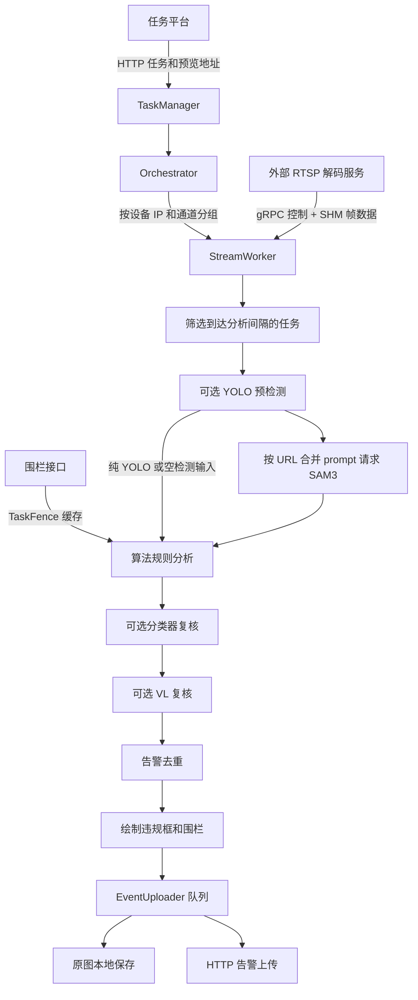

# AI 视频安监检测系统

AIDetection 是工业安全视频检测的 Python 业务服务：从任务平台同步摄像头与算法任务，通过外部 RTSP 解码服务获取视频帧，调用 Triton YOLO、SAM3 进行目标检测与分割，再使用空间规则、时序规则及可选的视觉大模型复核识别违规，最后生成告警截图并上报平台。

本仓库包含任务调度、推理客户端、检测规则、跟踪器、截图绘制和上传代码，不包含摄像头管理界面、模型权重、SAM3 服务、Triton 模型仓库或 C++ RTSP 服务端。运行完整系统需要先部署这些外部依赖。

> 当前代码已串联任务同步、拉流、推理、分析和告警流程，并非仅打印任务的入口桩代码。但当前仓库存在一个明确的启动阻塞：`src/task/upload.py` 导入了缺失的 `utils.frame_artifact_detector` 模块。完整服务启动前需补齐该模块，或在代码维护中移除已经停用的花屏检测逻辑所遗留的导入。下面的部署步骤以解决此阻塞、依赖服务就绪为前提。更多实际限制见[已知限制与排障](#已知限制与排障)。

## 目录

- [项目介绍与运行流程](#项目介绍与运行流程)
- [算法清单](#算法清单)
- [项目结构](#项目结构)
- [运行条件](#运行条件)
- [Docker 部署](#docker-部署)
- [本地 Python 运行](#本地-python-运行)
- [配置详解](#配置详解)
- [任务平台与围栏接口](#任务平台与围栏接口)
- [本地图片与服务联调](#本地图片与服务联调)
- [告警输出与日志](#告警输出与日志)
- [新增算法与开发](#新增算法与开发)
- [已知限制与排障](#已知限制与排障)

## 项目介绍与运行流程

### 核心能力

- **设备流复用**：按 `(deviceAlgorithmIp, deviceChannel)` 创建一个 `StreamWorker`，同一设备通道的多个任务共用视频帧。
- **任务动态同步**：轮询任务平台，增加或移除 worker，更新 RTSP 地址，并重新创建已退出的 worker。
- **按需推理**：每个算法具有独立的分析间隔；YOLO 预检未发现所需类别时，可省略该任务对应的 SAM3 请求。
- **SAM3 分组复用**：同一帧中就绪的任务按 SAM3 URL 分组，每组合并 prompt、统一决定是否返回 mask，再请求一次该接口。
- **规则分析**：支持目标框匹配、围栏关系、mask 几何运算、连续静止/缺席判断和人员跟踪。
- **分级复核**：规则命中后，按配置执行 Triton 分类器复核和 VL 视觉大模型复核。
- **告警处理**：按设备、算法、标签与位置去重，绘制 OSD，异步上传截图并保存原图。
- **流故障恢复**：检查断流、共享内存丢失等情况，尝试重连及重建流；连续恢复失败后由编排器重新创建 worker。

### 数据流



YOLO/SAM3 返回空结果时，生产主流程仍调用规则分析，让脱岗、单人作业等算法更新内部时序状态。多组 SAM3 结果会汇总为当前帧的检测框列表；不是每个任务各自请求一次，也不是整条流永远只有一次 SAM3 请求。

配置为 `thread_local_detectors` 的检测器按 worker 线程隔离实例；其他检测器共享实例，有状态的实现需要自行按设备隔离状态。

## 算法清单

以下依据当前 `config/algorithms.yaml` 和 `src/core/analyzer.py` 整理。**“启用”表示进入本地算法允许列表，实际运行仍要求任务平台下发对应任务。** 检测间隔是任务分析的最小调度间隔，不是保证达到的帧率，也不是判定违规所需的持续时间。

### 当前允许的 19 个算法

| 算法码 | 业务用途与实现 | 检测器 | 间隔（秒） | 拉取围栏 | SAM3 mask | VL 复核配置 |
| --- | --- | --- | ---: | --- | --- | --- |
| `0` | 未佩戴安全帽 | `HelmetDetector` | 10 | 否 | 否 | 未启用 |
| `8` | 危险区域闯入，使用人员及腿部目标判断 | `ZoneDetector` | 10 | 是 | 否 | 未启用 |
| `10` | 未穿工服或反光衣 | `VestDetector` | 10 | 否 | 是 | 关闭 |
| `14` | 吸烟 | `SmokingDetector` | 10 | 否 | 否 | 关闭 |
| `32` | 睡岗候选，连续静止计数后复核 | `SleepDutyDetector` | 3 | 否 | 是 | 开启 |
| `33` | 皮带跑偏，比较皮带 mask 与围栏 | `BeltDeviationDetector` | 20 | 是 | 是 | 未启用 |
| `34` | 单人作业 | `SingleDetector` | 10 | 否 | 否 | 未启用 |
| `38` | 脱岗/离岗 | `DepartureDetector` | 10 | 否 | 否 | 未启用 |
| `49` | 堆煤与围栏相交 | `CoalDetector` | 600 | 是 | 是 | 未启用 |
| `50` | 煤流异物 | `CoalForeignObjectDetector` | 10 | 是 | 否 | 开启 |
| `51` | 5 号皮带后煤流异物 | `CoalForeignObjectDetector5` | 1（默认） | 是 | 否 | 未启用 |
| `52` | 配置名为“车辆检测”，实际分析人员与车厢的关系 | `CarDetector` | 10 | 是 | 是 | 未启用 |
| `53` | 人员和火情出现但缺少灭火器，含火焰时序过滤 | `ExtinguisherDetector` | 10 | 否 | 否 | 未启用 |
| `56` | 玩手机 | `PlayPhoneDetector` | 10 | 否 | 否 | 未启用 |
| `58` | 登高作业未系安全带 | `HeightWorkDetector` | 10 | 是 | 是 | 开启 |
| `59` | 空车检查，识别煤残留 | `EmptyTruckDetector` | 10 | 否 | 是 | 未启用 |
| `60` | 人员靠近移动车辆 | `PersonApproachingMovingVehicleDetector` | 1 | 否 | 否 | 未启用 |
| `61` | 现场无监护人作业 | `UnsupervisedDetector` | 10 | 否 | 是 | 未启用 |
| `62` | 车辆进入卸煤沟警戒区域 | `CarZoneDetector` | 10 | 是 | 是 | 未启用 |

算法 `62` 的业务名称包含“两米内”，代码实际依据车辆 mask 与配置围栏的重叠进行判定，没有通用的像素到米转换；应在现场把两米警戒范围标成围栏。

### 已注册但未加入允许列表的算法

| 算法码 | 已有实现 | 启用时需要核对 |
| --- | --- | --- |
| `57` | 移动中使用手机，`MoveUsePhoneDetector` | 已有 YOLO 预检、全帧和线程隔离配置；检测器在确认移动后自行对历史裁剪帧调用 SAM3 |
| `200` | 手套 + 面罩，`GloveDetector` / `ShieldDetector` | 已有 SAM3 prompt；按组合规则调试 |
| `201` | 安全帽 + 裸露手臂/腿部 + 手套 | 已有 SAM3 prompt 与 mask 配置 |
| `204` | 区域入侵，`ZoneDetector` | 目前缺少匹配的 SAM3 prompt、围栏同步等配套配置 |
| `205` | 安全绳/安全带，`SafetyDetector` | 有 VL prompt 配置，但缺少匹配的上游检测输入配置 |

`16`、`37`、`39`、`54`、`55` 等虽然有描述或 prompt，目前没有对应的 `algorithm_detectors` 映射；只加入 `supported_codes` 不会自动获得检测功能。当前配置也没有独立的 `99` 手套任务，手套检测包含在 `200`、`201` 中。

## 项目结构

```text
AIDetection/
├── main.py                         # 添加模块路径并调用 src/main.py
├── Dockerfile                      # Python 3.13 运行环境，不内置项目代码
├── docker-compose.yml              # 应用、目录挂载、可选外部 Compose include
├── docker-compose.empty.yml        # 外部服务未配置时的空占位
├── .env.example                    # 环境变量模板
├── config/
│   ├── algorithms.yaml             # 算法允许列表、prompt、检测器、间隔、复核、去重
│   ├── models.yaml                 # YOLO 与分类模型参数
│   └── names/                      # COCO 和自定义类别名称
├── src/
│   ├── main.py                     # 启动 Orchestrator
│   ├── config/config.py            # 环境变量读取、YAML 合并、Pydantic 配置对象
│   ├── core/                       # orchestrator、stream_worker、analyzer、classifier
│   ├── task/                       # 任务同步、围栏缓存、异步上传
│   ├── stream/                     # RTSPClient、协议及生成的 gRPC 代码
│   ├── detect/                     # SAM3、YOLO、分类模型客户端
│   ├── triton_client/              # HTTP / gRPC / SHM 统一 Triton 客户端
│   ├── analyze/                    # 安监后处理规则
│   ├── obj_track/                  # ByteTrack / OCSort
│   ├── llm/                        # OpenAI 兼容视觉接口客户端、VL 复核、prompt
│   └── utils/                      # Box、mask/RLE、过滤、去重、OSD、日志
├── tests/local/                    # 图片、Triton、VL 手动联调脚本
├── assets/                         # 图片与结果素材（按环境准备）
└── logs/                           # 默认日志输出目录
```

主要技术依赖：Python 3.13、Pydantic、python-dotenv、PyYAML、requests、OpenCV、NumPy、Shapely、gRPC/Protobuf、Triton Client，以及用于跟踪和视觉复核的相关库。依赖安装方式目前写在 `Dockerfile` 中，仓库没有 `requirements.txt` 或 `pyproject.toml`。

## 运行条件

### 外部服务

| 服务 | 用途 | 配置入口 | 何时需要 |
| --- | --- | --- | --- |
| 任务/告警平台 | 任务、预览地址、围栏、告警接收 | `GET_TASK_URL`、`GET_RTSP_URL`、`GET_FENCE_URL`、`UPLOAD_URL` | 完整生产流程 |
| C++ RTSP 服务 | 解码摄像头视频，通过 gRPC 管理流并写入 SHM | `STREAM_SERVER_ADDRESS` | 完整视频流程 |
| SAM3 | 文本提示词驱动的检测/分割 | YAML 的 `sam3_url_groups`、`SAM3_URL_OBJ` | 配置了 SAM3 的算法或内部调用 SAM3 的检测器 |
| Triton YOLO ensemble | 预检测和纯 YOLO 输入 | `TRITON_YOLO_URL`、`models.yaml` | 配置了 `yolo_pre_detect` 的算法 |
| Triton 分类模型 | 对规则命中的裁剪区域复核 | `classification_configs`、`algorithm_classifiers` | 显式绑定分类器时 |
| OpenAI 兼容视觉服务 | VL 二次确认 | `VL_*`、`algorithm_vl_config` | 全局和算法开关均开启时 |

服务端代码和模型需从各自项目部署。本项目只发起客户端请求，不会自动下载或加载模型权重。

### 操作系统和共享内存

完整服务的主路径面向 **Linux**。`StreamWorker` 当前固定使用 RTSP SHM 模式和 CPU FFmpeg 解码，Python 从 `/dev/shm/{stream_id}` 读取帧。RTSP 服务端与应用必须在同一 Linux 主机上，或能访问同一套实际共享内存文件；仅把 gRPC 地址设为另一台服务器，不能把该服务器的 SHM 自动传过来。

Triton 也有独立的 SHM 传输机制。生产 YOLO 和分类客户端当前使用 `TRITON_YOLO_URL` 配合 `protocol="shm"`，SHM 失败可回退 HTTP；要真正启用 Triton SHM，Triton 容器也必须看到客户端创建的共享内存对象。

RTSP 客户端另有 JPEG-over-gRPC 模式，可用于跨机器单独联调，但主 worker 没有通过 `.env` 切换此模式的配置项。Windows 原生环境适合编辑、配置检查及部分 HTTP 图片联调；不要直接套用 Linux SHM 的生产启动方式。

## Docker 部署

以下命令在 Linux 的项目根目录执行，需要支持 `include` 的 Docker Compose。先解决文首列出的缺失模块问题。

### 1. 准备配置与目录

```bash
# 首次部署时复制；已有 .env 时保留现有配置
cp -n .env.example .env

# 以下使用模板中的 SHM_NAMESPACE=aidetection；修改命名空间后同步调整目录
sudo mkdir -p /dev/shm/aidetection /mnt/yolo/images /mnt/yolo/artifacts
mkdir -p logs
```

编辑 `.env`，设置任务平台、SAM3、Triton、RTSP 服务及 VL 地址。同时检查 `config/algorithms.yaml` 的 `sam3_url_groups`，其中的具体 URL 不会被同名环境变量替换。

模板使用 `STREAM_SERVER_ADDRESS=grpc_rtsp:50051`、`TRITON_YOLO_URL=triton:38000`。这些服务名只有在相应 Docker 网络中可解析时才有效；独立部署时应填写可达地址。端口必须是从 **应用容器内** 实际访问的服务端口，不能把宿主机映射端口和容器监听端口混淆。

### 2. 连接外部服务

若已部署依赖服务，可保留 Compose 中的空 `include` 默认值。若希望一起管理外部项目，在 `.env` 设置实际存在的 Compose 文件：

```dotenv
GRPC_RTSP_COMPOSE=../grpc_rtsp/docker-compose.yml
TRITON_COMPOSE=../triton/docker-compose.yml
SHM_NAMESPACE=aidetection
```

默认值是 `./docker-compose.empty.yml`；指定了不存在的外部文件时仍会报错，并不会再次自动回退。应用没有 `depends_on`，启动顺序和依赖就绪状态需要自行确认。

RTSP 服务端应与应用挂载同一个宿主机目录：

```yaml
volumes:
  - /dev/shm/${SHM_NAMESPACE:-aidetection}:/dev/shm
```

同时确保双方有读写权限。若 Triton 使用 SHM，也要协调其 `/dev/shm` 挂载。`SHM_NAMESPACE` 由 Compose 用来生成挂载路径，Python 内部仍读取 `/dev/shm/{stream_id}`。

### 3. 检查、构建与启动

```bash
# 只校验 Compose 配置，不打印环境变量内容
docker compose config -q

# 仅构建本项目，避免构建 include 中的外部服务
docker compose build aidetection

# 外部服务已经运行时，仅启动检测应用
docker compose up -d --no-deps aidetection

docker compose ps aidetection
docker compose logs --tail=100 -f aidetection
```

需要同时启动已 include 的外部服务时使用 `docker compose up -d`。应用不提供 Web 页面或 HTTP 健康检查端点；观察日志确认任务同步、worker 创建、推理与告警行为。

`Dockerfile` 只安装运行环境，通过 `.:/app` 挂载代码。单独 `docker build -t aidetection:latest .` 得到的镜像也需要运行时挂载源码，不能当作包含源码的独立交付镜像直接启动。

构建环境无法访问默认基础镜像时，可把 `.env` 的 `AIDETECTION_BASE_IMAGE` 设为实际可访问且兼容的 Python 3.13 镜像。Dockerfile 内的 apt/pip 镜像源也需要可达。

### 4. 更新与停止

| 操作 | 命令或方式 |
| --- | --- |
| 修改 Python 或 YAML 后生效 | `docker compose restart aidetection` |
| 修改 `.env` 后重新注入环境 | `docker compose up -d --no-deps --force-recreate aidetection` |
| 修改依赖或 Dockerfile | 重新 build，然后重新创建应用容器 |
| 停止检测应用 | `docker compose stop aidetection` |
| 查看最近日志 | `docker compose logs --tail=200 aidetection` |

代码和 YAML 在启动时加载，不支持文件级热加载。远程任务新增/删除和 RTSP 地址更新有单独的同步机制。

当前 Compose 绑定了 `/mnt/yolo/images`、`/mnt/yolo/artifacts`、`/etc/localtime`、`/etc/timezone`，部署主机需有相应路径；部分 Linux 发行版没有 `/etc/timezone`，需调整该挂载。同机多实例除设置不同 `SHM_NAMESPACE` 外，还需调整固定的 `container_name: aidetection`，并规划输出目录。

## 本地 Python 运行

### 1. 安装环境

下面按仓库 Dockerfile 的依赖组合列出 Debian/Ubuntu 风格的 Linux 安装步骤，使用 Python 3.13 虚拟环境。系统 Python 开发头文件应与使用的解释器匹配。

```bash
sudo apt-get update
sudo apt-get install -y libgl1 libglib2.0-0 libgomp1 libturbojpeg0 libgeos-c1v5 build-essential python3-dev

python3.13 -m venv .venv
source .venv/bin/activate
python -m pip install --upgrade pip
python -m pip install pydantic python-dotenv pyyaml requests opencv-python-headless numpy shapely protobuf PyTurboJPEG posix_ipc openai scipy filterpy lap cython-bbox "tritonclient[all]"

# 与当前 Dockerfile 和生成的 gRPC 代码对齐
python -m pip install grpcio==1.81.1 grpcio-tools==1.81.1
python -m pip check
```

当前生成文件要求 `grpcio >= 1.81.1`，Protobuf 生成版本为 `6.33.5`。某些 `tritonclient[all]` 版本的 gRPC 约束可能与之冲突，Dockerfile 采用后安装指定 gRPC 版本的方式；这不等于所有依赖约束已经兼容。如果 `pip check` 报冲突，需要结合实际 Triton 服务版本解决并做联调，仓库目前没有锁定完整依赖版本。

### 2. 配置并启动

```bash
cp -n .env.example .env

# 只导入配置，不连接任务平台或推理服务
PYTHONPATH=src python -c "from config.config import config; print('enabled algorithms:', ', '.join(config.ALGORITHM_CODES))"

# 依赖、共享内存和缺失模块均准备完成后启动
python main.py
```

直接运行时，RTSP 后端应把 SHM 写到应用可见的 `/dev/shm`。只在 shell 中设置 `SHM_NAMESPACE` 不会改变 Python 的文件读取路径；命名空间隔离依赖容器挂载。

入口会自动加入 `src` 和 `src/stream` 模块搜索路径。通过 `Ctrl+C` 可触发前台运行的退出清理。服务没有 `--rtsp`、`--algo` 等启动参数，任务由平台下发，算法由 YAML 配置。

Windows PowerShell 可用下面的方式准备模板和检查配置，前提是当前 Python 环境已安装配置层依赖：

```powershell
if (-not (Test-Path .env)) { Copy-Item .env.example .env }
$env:PYTHONPATH = "src;src/stream"
python -c "from config.config import config; print(config.ALGORITHM_CODES)"
```

完整视频服务请使用能满足 SHM 条件的 Linux 环境；这段 PowerShell 命令不验证视频和模型服务。

## 配置详解

### 配置来源与生效方式

| 位置 | 负责内容 | 生效方式 |
| --- | --- | --- |
| `.env` / 进程环境变量 | 服务地址、VL 开关、任务同步周期、保存路径等 | 重启进程；Compose 环境变量变更需重新创建容器 |
| `config/algorithms.yaml` | 允许算法、prompt、检测器、围栏、间隔、复核、去重 | 重启进程 |
| `config/models.yaml` | YOLO 和分类模型参数 | 重启进程 |
| `config/names/*.names` | YOLO 类别 ID 到名称映射 | 重启进程 |
| 任务/围栏平台 | 任务列表、预览地址、围栏坐标 | 按各自轮询周期同步 |
| `src/analyze/*.py` | 检测器内部阈值、时序规则 | 修改代码后重启 |

`load_dotenv()` 默认不覆盖已存在的进程环境变量；配置中显式使用 `os.getenv(...)` 的字段才支持环境变量覆盖，不能假定任意 Pydantic 字段都能用同名环境变量修改。`models.yaml` 合并到 `algorithms.yaml` 后，同名顶层键以前者为准。

当前没有 `hdzp/company/mhwj` 环境类选择机制；`get_config(env)` 保留了参数但始终返回 `BaseConfig`。换环境应修改地址和业务配置。

### 环境变量

“代码默认”指未设置进程变量和 `.env` 时 `src/config/config.py` 中的值。

| 变量 | 代码默认 | 说明 |
| --- | --- | --- |
| `GET_TASK_URL` | `http://192.168.100.73/open/api/operate/taskList` | 获取任务 |
| `GET_FENCE_URL` | `http://192.168.100.73/open/api/operate/fence` | 获取围栏 |
| `GET_RTSP_URL` | `http://192.168.100.73/open/api/operate/previewURLs` | 获取/刷新流地址 |
| `UPLOAD_URL` | `http://192.168.100.73/open/api/operate/upload` | 告警上传 |
| `REQUEST_INTERVAL` | `180` | 任务管理器和编排器各自的轮询间隔（秒）；模板设为 `10` |
| `STREAM_SERVER_ADDRESS` | `192.168.100.74:50051` | RTSP gRPC 地址；模板设为 `grpc_rtsp:50051` |
| `STREAM_RECOVERY_COOLDOWN_SEC` | `10.0` | 两次流恢复之间的最小间隔（秒） |
| `SAM3_URL` | `http://192.168.100.75:18002/predict` | 保留的常规接口配置；主 worker 不直接用它选择 URL |
| `SAM3_URL_OBJ` | `http://192.168.100.75:18002/predict-person-about-small-object` | 未分组算法的 SAM3 回退地址 |
| `TRITON_YOLO_URL` | `192.168.100.74:38000` | 当前生产 YOLO/分类的 HTTP/SHM 地址，不带 `http://`；模板用 `triton:38000` |
| `TRITON_YOLO_GRPC_URL` | `192.168.100.74:38001` | 已定义，但当前主 worker 的 YOLO 工厂未使用 |
| `TRITON_CLASSIFIER_GRPC_URL` | `192.168.100.74:38001` | 已定义，但当前分类器工厂未使用 |
| `VL_ENABLED` | `true` | VL 全局开关，另需算法配置开启 |
| `VL_API_URL` | `http://192.168.100.75:18000/v1` | OpenAI 兼容接口 base URL |
| `VL_MODEL` | `/models/qwen3-vl-4b` | 服务端实际提供的模型标识 |
| `VL_API_KEY` | `EMPTY` | 模板为空；根据部署接口填写 |
| `VL_ENABLE_THINKING` | `false` | 模板设为 `true`，需注意响应耗时与服务端支持 |
| `VIOLATION_IMAGE_SAVE_DIR` | `/mnt/yolo/images` | 违规原图根目录 |

`SHM_NAMESPACE`、`GRPC_RTSP_COMPOSE`、`TRITON_COMPOSE`、`AIDETECTION_BASE_IMAGE` 是 Compose/构建配置，不是算法运行时字段。更改 `VIOLATION_IMAGE_SAVE_DIR` 后，也要把新的容器路径挂载到需要持久化的宿主机目录。

### 算法配置

算法码使用字符串，例如 `'8'`。`supported_codes` 是字符串列表；其他按算法码索引的配置通常是含 `code` 的对象列表，可用内联对象或多行 YAML，不要改成 `8: ...` 的字典结构。

下面是算法 `8` 的配置片段。应合并到原有对应段中，不要重复创建同名顶层键：

```yaml
supported_codes: ['8']

sam3_prompts:
  - {code: '8', prompts: [person, person leg], return_mask: false}

sam3_url_groups:
  - url: 'http://sam3-server:18002/predict'
    codes: ['8']

fence_algorithms:
  - {code: '8'}

yolo_pre_detect:
  - {code: '8', yolo26_ensemble: [person]}

algorithm_detectors:
  - {code: '8', detectors: [ZoneDetector]}

algorithm_intervals:
  - {code: '8', interval: 10.0}

alert_dedup:
  - {code: '8', enabled: true, cooldown_seconds: 300, iou_thresh: 0.5}
```

关键字段的含义：

| 字段 | 用途与注意事项 |
| --- | --- |
| `supported_codes` | 本地允许处理的算法码；不会主动在平台创建任务 |
| `code_descriptions` | 业务名称；每项使用 `descriptions` 字段，也用于原图分类目录 |
| `sam3_prompts` | 上游标签和是否返回 mask，标签需要匹配检测器中的筛选条件 |
| `sam3_url_groups` | 固定 URL 到算法列表的映射；未分组回退 `SAM3_URL_OBJ` |
| `fence_algorithms` | 指定哪些算法从围栏 API 同步区域 |
| `yolo_pre_detect` | 算法使用的模型名和预检类别；当前每个算法只取第一个模型配置 |
| `use_yolo_boxes` | 补充 SAM3 结果中缺失类别的 YOLO 框，不是逐框去重合并 |
| `algorithm_detectors` | 一个算法可绑定多个已注册检测器，其返回结果汇总 |
| `default_algorithm_interval` | 未指定间隔时的默认秒数；省略时为 `1.0` |
| `algorithm_intervals` | 按算法设置分析间隔；`sleepJudgeTime` 任务字段不控制此间隔 |
| `full_frame_algorithms` | 同一 worker 只要包含此类任务，就要求拉取全部帧；当前为 `57` |
| `thread_local_detectors` | 带状态且需要线程隔离的检测器；当前为 `MoveUsePhoneDetector`、`SleepDutyDetector` |
| `alert_dedup` | 冷却秒数与位置 IoU 阈值；未配置或关闭时不执行该步 |
| `gpu_codes` | 编排器轮询分配的 GPU 编号；当前 CPU 解码配置没有把编号传给后端，不代表已启用 GPU 解码 |

YAML 用 `yaml.safe_load` 读取，没有环境变量插值功能。不要在 `sam3_url_groups.url` 中写 `${SAM3_URL}` 并期待自动展开；修改其中的实际 URL，或移除相应分组使算法使用 `SAM3_URL_OBJ`。

纯 YOLO 输入通常通过不配置 SAM3 prompt 实现，同时必须配置 `yolo_pre_detect` 并使用支持 YOLO 标签的检测器。有一个例外：算法没有 prompt 条目、且任务 `electricFence` 非空时，代码会回退到 `person` prompt。需要明确禁用这类回退时，可给该算法配置 `prompts: []`。算法 `57` 即使上游不走 SAM3，其检测器内部仍会调用 SAM3。

### 模型配置

`config/models.yaml` 当前定义 `yolo26_ensemble`、`yolov5_ensemble` 和分类器配置 `resnet_smoke`。模型名称必须与 Triton 服务端的实际模型名一致，`.names` 中的有效非空行从 0 开始映射类别 ID，类别名称须与 `yolo_pre_detect` 一致。

```yaml
yolo_model_configs:
  - name: yolo26_ensemble
    input_name: raw_image
    input_size: 640
    conf_thresh: 0.5
    iou_thresh: 0.45
    label_map_file: config/names/coco.names
```

当前 YOLO 封装面向已集成预处理和后处理的 Triton ensemble：输入是 RGB、`uint8`、形状 `[1, H, W, 3]`；输出使用 `num_dets`、`detection_boxes`、`detection_scores`、`detection_classes`、`transform_metadata`。它不能直接替代任意原始 ONNX/YOLO 输出解析器。

`conf_thresh` 用于客户端置信度过滤；`iou_thresh` 和 `output_format` 在当前封装中只为兼容保留，不改变服务端 NMS。要调整 NMS，应同步修改外部 Triton 模型配置。SHM 输出缓冲区按最多 300 个检测框预设，需与服务端输出规格一致。

### 分类器与 VL 复核

规则违规先进入分类器，再进入 VL；它们都不会自动对整幅图像持续巡检。

当前分类器仅绑定到未启用的算法 `1000`，所以默认允许列表中的算法不会调用 `resnet_smoke`。例如需要给吸烟算法接入分类复核，可在确认模型已部署后，将以下条目加入 `algorithm_classifiers`：

```yaml
algorithm_classifiers:
  - {code: '14', classifiers: [resnet_smoke]}
```

分类器的 `labels`、`target_class`、`conf_thresh`、`expand_ratio` 在 `models.yaml` 配置，分别控制类别顺序、目标类别、置信度和裁剪扩展比例。

VL 要同时满足以下条件：

1. `.env` 中 `VL_ENABLED=true`，并配置可达的 `VL_API_URL`、正确的 `VL_MODEL` 和所需密钥。
2. 算法条目设置 `enabled: true`，例如 `{code: '58', enabled: true, module: height_work}`。
3. `src/llm/prompts/height_work.py` 提供 `PROMPTS` 字符串或按违规标签索引的字典，可使用 `default` 兜底。

VL 客户端请求 JSON 结果，核心字段为 `has_violation`。返回 false 会过滤候选违规；客户端不可用、缺少 prompt、请求异常或 JSON 解析失败时，现有实现通常保留规则候选。因此“上报了告警”不能作为“VL 已成功确认”的依据，应检查复核日志。

## 任务平台与围栏接口

### 任务获取和流地址

平台接口在当前客户端中使用 **HTTP POST + URL query 参数**，不是 POST JSON。

| 接口 | Query 参数 | 客户端读取的响应 |
| --- | --- | --- |
| `GET_TASK_URL` | `algorithmCode`，主入口传空字符串 | 顶层 `data` 任务数组 |
| `GET_RTSP_URL` | `ip`、`channel`、`protocol`（空字符串） | `code == 0` 时取 `msg` 作为流地址 |
| `GET_FENCE_URL` | `algorithmCode`、`algorithmIp`、`channel` | `code == 0` 时取 `data.pointCollections` |

任务响应示例：

```json
{
  "data": [
    {
      "id": "task-001",
      "alarmTaskName": "卸煤区人员入侵",
      "deviceId": "camera-001",
      "deviceAlgorithmIp": "192.0.2.10",
      "deviceChannel": "1",
      "algorithmCode": "8",
      "algorithmName": "危险区域闯入",
      "playbackAddress": "rtsp://camera.example/live",
      "electricFence": null
    }
  ]
}
```

`id` 应唯一，`deviceAlgorithmIp` 和 `deviceChannel` 必须非空。`deviceId` 用于检测器状态及告警去重，应稳定标识设备/通道。每次任务同步会尝试调用预览地址接口，成功时覆盖 `playbackAddress`，否则保留任务返回的地址。算法码不在允许列表、设备标识缺失或最终流地址为空时不会创建对应 worker。

`Task` 还保留设备凭据、`sleepJudgeTime`、`personLimitNum` 等平台字段，但不能把“已接收字段”理解为当前规则都使用了这些参数。多数检测阈值和持续时间仍定义在检测器代码中。

### 电子围栏

`TaskFence` 是共享缓存管理器，按 `(算法码, 设备 IP, 通道)` 注册需要的围栏，后台默认每 30 秒同步。首次注册不立即执行 HTTP 请求，可能需要等待下一轮。

围栏响应示例：

```json
{
  "code": 0,
  "data": {
    "pointCollections": "100#100,700#100,700#500,100#500,||900#100,1200#100,1200#400,900#400,"
  }
}
```

坐标格式为 `x#y`，点之间用逗号分隔，区域之间用 `||` 分隔。每个区域至少需要 3 个有效顶点。坐标是视频帧的像素坐标，应与实际送入分析的分辨率一致。

生产 worker 只对 `fence_algorithms` 中的算法查询围栏 API；未获取到有效围栏时传入 `None`。当前分发代码并未按其注释实现通用的 `task.electricFence` 回退，因此不能只在任务字段填围栏就假定所有生产算法都能获取。区域入侵、堆煤等依赖围栏的算法在无围栏时通常不返回违规。

## 本地图片与服务联调

这些是依赖真实推理服务的**手动联调脚本**，不是无需外部服务的完整单元测试套件。图片脚本不需要任务平台或 RTSP 服务，也不会调用 `EventUploader` 上传告警。

### 1. 单张图片验证 SAM3 和规则

先在项目中准备图片，并把 SAM3 URL 改为可访问的实际地址：

```bash
python tests/local/test_local_image.py --help

# 安全帽：只调用 SAM3 和规则，关闭复核
python tests/local/test_local_image.py -i assets/images/test.jpg -a 0 --mode sam3-only --no-vl --no-classifier -o assets/results

# 区域入侵：围栏坐标按输入图片实际尺寸修改
python tests/local/test_local_image.py -i assets/images/test.jpg -a 8 --mode sam3-only --fence "100#100,700#100,700#500,100#500" --no-vl -o assets/results

# 验证 YOLO 预检 -> SAM3 -> 规则 -> 已配置的复核
python tests/local/test_local_image.py -i assets/images/test.jpg -a 58 --mode yolo-sam3 -o assets/results
```

`--mode yolo-only` 只改变输入推理来源，后面仍运行规则分析和按配置启用的复核。它不能替代需要 SAM3 专用标签/mask 的算法验证；例如当前 `ZoneDetector` 只接受 `source="SAM3"` 的 person，并要求腿部目标，纯 YOLO 框不会触发该规则。

### 2. 参数与结果

| 参数 | 说明 |
| --- | --- |
| `-i / --image` | 单张图片或目录；目录扫描不递归，支持 JPG/JPEG/PNG/BMP/WebP |
| `-a / --algo` | 单个算法码；不填则测试 `supported_codes` 与 `test_local.algorithms` 的并集 |
| `-o / --output` | 输出根目录，默认 `./test_results` |
| `-m / --mode` | `yolo-sam3`（默认）、`yolo-only`、`sam3-only` |
| `--fence` | 临时围栏，优先于 `test_local` 的围栏 |
| `--no-classifier` | 关闭本地测试的分类复核 |
| `--no-vl` | 关闭本地测试的 VL 复核 |
| `--force-vl` | 规则无违规时用全部检测框作为 VL 候选；仍要求全局与算法 VL 开关开启 |
| `--no-shm` | 脚本有此参数，但当前底层封装未使用传入的 `use_shared_memory`，不能保证强制 HTTP，见排障 |

结果按算法名称和判定状态保存：

```text
assets/results/
└── 未戴安全帽/
    ├── violation/test_result.jpg
    └── no_violation/other_result.jpg
```

结果图存在或脚本打印“处理成功”只代表完成图片处理，不代表推理调用成功或准确率达标；服务异常可能返回空检测结果，应同时检查日志。

### 3. 批量测试配置

当前 YAML 未设置 `test_local`，代码默认目录拼写为 `./asserts/images`。为避免路径混淆，使用显式 `-i`，或加入如下配置：

```yaml
test_local:
  default_image_dir: ./assets/images
  enable_classifier: false
  enable_vl: false
  algorithms:
    - {code: '0', image: assets/images/helmet.jpg, mode: sam3-only}
    - {code: '8', image: assets/images/zone.jpg, mode: sam3-only, fence: '100#100,700#100,700#500,100#500'}
```

```bash
python tests/local/test_local_image.py -a 8 -o assets/results
```

这里有两项优先级容易混淆：算法配置的 `image` 优先于命令行 `-i`；算法配置的 `mode` 优先于命令行 `--mode`。围栏则是命令行 `--fence` 优先。`enable_vl: false` 后，`--force-vl` 也不会把它重新开启。

睡岗、单人作业、脱岗、火焰时序判断、移动行为等需要历史状态和时间积累，单张图片不能验证完整触发条件；快速遍历一组静态图片也不等价于按生产间隔处理视频。完整验收应使用连续帧和实际任务流程。本地脚本也不执行生产告警去重。

### 4. Triton 独立联调

`test_triton.py` 默认 URL 是 `localhost:38000`，不会自动取 `.env` 中的 `TRITON_YOLO_URL`，应显式传入地址：

```bash
python tests/local/test_triton.py --help
python tests/local/test_triton.py -i assets/images/test.jpg --url triton-server:38000 --model yolo26_ensemble --classes 0 -n 20 --save assets/results/triton_test.jpg
```

该脚本默认用 COCO 类别映射；测试自定义类别模型时应使用按 `models.yaml` 加载标签的图片脚本，或自行给 `YOLOTritonFast` 传入 `label_map`。

要明确选择 HTTP，可在调用 `YOLOTritonFast` 时传 `protocol="http"`；当前两个本地 CLI 脚本的 `--no-shm` 尚未正确传递为协议选择。通用 Triton 客户端还有独立的连通性/推理测试：

```bash
python src/triton_client/test_client.py --help
```

其接口与其他示例见 `src/triton_client/README.md`，运行测试需要实际 Triton 服务。

### 5. RTSP 和 VL 联调入口

`src/stream/remote_capture.py` 末尾包含 JPEG 和 SHM 两种示例，但其中服务器和摄像头地址写在源码内，运行前必须替换为自己的测试地址。该示例不读取 `.env` 的流地址：

```bash
PYTHONPATH=src:src/stream python -m stream.remote_capture
```

PowerShell 中设置 `$env:PYTHONPATH = "src;src/stream"` 后再运行 `python -m stream.remote_capture`。跨机器时只验证 JPEG 路径，SHM 示例仍需满足 Linux 同机共享目录条件。

`tests/local/test_llm.py` 是简易 VL 示例，图片路径固定为 `asserts/images/test.jpg`，需要先修改路径并配置 `VL_*`。按算法验证 VL 更适合使用 `test_local_image.py -a 58` 等路径；`--force-vl` 仅用于额外调试候选复核，不代表生产的实际告警行为。

## 告警输出与日志

### 告警流程

规则命中、复核通过且未被去重的目标会绘制为 OSD 图，当前生产调用绘制违规框及围栏，不绘制全部检测框。图片联调脚本则同时绘制全部检测框和违规框。

全局 `EventUploader` 使用容量为 **10** 的内存队列和一个后台线程，队列满时丢弃最旧告警。每条出队告警先保存原图，再上传 OSD JPEG；上传超时为 10 秒，失败没有持久化重试队列。

原图目录格式：

```text
<VIOLATION_IMAGE_SAVE_DIR>/<算法中文名称>/<YYYY-MM-DD>/
    <YYYYMMDD_HHMMSS_mmm>_task<任务ID>_algo<算法码>.jpg
```

只有出队执行的告警才走原图保存，不能把“已入队”当作“已落盘”。原图不会自动按天清理，应按实际采集量管理磁盘空间。

上传协议为 `POST UPLOAD_URL`：

| 位置 | 字段 | 内容 |
| --- | --- | --- |
| Query | `ip`、`channel` | 任务的设备 IP 和通道 |
| Query | `classIndex` | 算法码 |
| Query | `videoTime` | 上传时生成的本地时间，格式 `YYYY-MM-DD HH:MM:SS`，并非原始帧采集时间 |
| Query | `levelId` | 固定为 `1` |
| Multipart | `file` | 名为 `violation.jpg` 的 OSD JPEG |

HTTP 200 且响应 JSON 的 `code == 0` 才记为业务上传成功。任务 ID 当前用于本地文件名，没有作为单独表单字段上报。

### 日志配置

默认输出到控制台和 `logs/app.log`，文件按 10 MiB 轮转，保留 5 个备份。

| 环境变量 | 默认 | 作用 |
| --- | --- | --- |
| `AIDETECTION_LOG_LEVEL` | `INFO` | `DEBUG/INFO/WARNING/ERROR/CRITICAL` |
| `AIDETECTION_LOG_FILE` | `logs/app.log` | 日志文件路径 |
| `AIDETECTION_LOG_DISABLE_CONSOLE` | 关闭 | 设 `1/true/yes/on` 禁用控制台 |
| `AIDETECTION_LOG_DISABLE_FILE` | 关闭 | 设 `1/true/yes/on` 禁用文件日志 |

```bash
AIDETECTION_LOG_LEVEL=DEBUG python main.py
AIDETECTION_LOG_LEVEL=INFO AIDETECTION_LOG_DISABLE_CONSOLE=1 python main.py
```

直接运行主入口时，日志模块可能先于 `.env` 加载并读取环境变量，因此日志开关宜在启动命令或 shell 中设置。Compose 的 `env_file` 会在进程启动前注入这些变量。

排查时按“同步任务配置 -> 新增视频流 worker -> YOLO/SAM3 返回 -> 分析完成 -> VL 二次确认 -> 已加入上传队列 -> 报警上传成功”跟踪一次事件。DEBUG 日志还有帧延迟和各阶段耗时。RTSP 地址等日志可能含连接凭据，分享日志前应处理这些内容。

## 新增算法与开发

1. 在 `src/analyze/` 实现检测器，接收 `Box` 列表，返回扁平的违规 `Box` 列表。
2. 在 `src/core/analyzer.py` 导入类并加入 `_DETECTOR_CLASSES`；无需为每个算法新增硬编码分支。
3. 在 `algorithms.yaml` 配置 `algorithm_detectors`、`sam3_prompts` 或 `yolo_pre_detect`、名称、检测间隔和去重；需要区域时加入 `fence_algorithms`。
4. 新模型在 `models.yaml` 配置，并确认 Triton 服务端已加载；新 VL 场景在 `src/llm/prompts/` 定义 `PROMPTS` 并配置 `algorithm_vl_config`。
5. 有跨帧状态的检测器选择按 `device_id` 隔离并加锁，或加入 `thread_local_detectors`；用多路视频验证状态隔离。
6. 先用图片验证标签、坐标、mask 和规则，再用连续视频验证时间条件。确认后把算法加入 `supported_codes`，并在平台创建对应任务。

检测器接口示例：

```python
def detect(
    self,
    predictions: list[Box],
    fences=None,
    device_id: str = "",
    image_width: int = 0,
    image_height: int = 0,
    frame=None,
) -> list[Box]:
    # 分析当前输入，返回需要上报的目标框
    return []
```

`frame` 可选，分发器只在检测器签名支持时传入。`Box.box` 为原图像素坐标 `[x1, y1, x2, y2]`，`source` 区分 SAM3/YOLO；涉及区域分割的规则需要有效 mask 和原图尺寸。SAM3 客户端接受结果项中的 `label`、`score`、`box`、`mask`，上游接口改动时应同步核对解析逻辑。

修改 `.proto` 后，在项目根目录使用匹配的编译工具重新生成：

```bash
python -m grpc_tools.protoc --python_out=. --grpc_python_out=. -I. src/stream/stream_service.proto
```

生成后检查 Python gRPC/Protobuf 运行时与外部 C++ 服务协议兼容。现有联调脚本不能替代 Box/RLE 边界、Mock API、时序重置和多路并发等自动化测试。

## 已知限制与排障

本节记录从当前代码可确认的行为，不代表所有外部部署环境已通过联调。

| 现象 | 原因与处理方向 |
| --- | --- |
| 启动报 `No module named 'utils.frame_artifact_detector'` | `src/task/upload.py` 顶层导入了仓库缺失模块；虽然花屏检测调用已注释，导入仍执行。需补齐模块或移除废弃导入 |
| gRPC 导入时版本异常 | 当前生成代码要求 `grpcio >= 1.81.1`、匹配 Protobuf 6.33.5 生成代码；核对安装结果和 Triton 依赖冲突 |
| Docker 镜像启动后找不到 `main.py` | 运行镜像没有内置源码，需挂载项目目录到 `/app` |
| `grpc_rtsp` 或 `triton` 无法解析 | 服务没有加入对应 Docker 网络，或外部 include 仍为空；调整服务网络或填写实际地址 |
| gRPC 连接成功但持续没有帧 | 检查 RTSP 是否可用、服务端是否解码、双方 SHM 挂载和权限是否一致；远程主机的 SHM 不会通过 gRPC 自动传输 |
| 多路高分辨率视频运行异常 | 检查宿主机 `/dev/shm` 容量。8 槽 RGB 缓冲粗略需要 `宽 × 高 × 3 × 8` 字节/流，1080p 约 47.5 MiB/流，另加对齐和 Triton 缓冲；bind mount 场景仅改 Compose `shm_size` 无效 |
| 改 `.env` 后仍访问旧 SAM3 地址 | 检查 `sam3_url_groups` 中的固定 URL；环境变量不覆盖这部分 YAML |
| 改 gRPC URL 变量后 YOLO/分类仍走 HTTP/SHM | 当前客户端工厂使用 `TRITON_YOLO_URL` 和固定 `protocol="shm"`，两个 gRPC 地址变量尚未接入主流程 |
| `--no-shm` 后仍尝试共享内存 | 本地脚本传入的 `use_shared_memory` 参数没有参与 `YOLOTritonFast` 的协议选择；需由调用处显式指定 `protocol="http"` |
| 没有 worker 或任务被跳过 | 检查平台 `data`、算法允许列表、设备 IP/通道、预览接口返回的 `msg` 和 RTSP 地址 |
| 平台请求短暂失败后流被移除 | `TaskManager` 在请求前清空任务缓存，失败会留下空列表，后续编排可能停止 worker；当前不保证保留上一轮成功任务 |
| 同一任务 ID 的配置修改未生效 | 编排器按任务 ID 集合判断是否调用 `update_tasks`；集合不变时普通字段未必刷新。RTSP 地址和围栏有独立更新路径，其他变更可重启应用确保加载 |
| 切换全帧算法后拉流模式未立刻改变 | `only_key_frames` 参数在下一次流重建时生效；开启全帧也不保证每一帧都被规则处理 |
| 区域算法没有告警 | 检查围栏是否已同步、顶点是否有效、坐标是否对应当前分辨率，以及检测器要求的标签、来源和 mask |
| 睡岗等算法单张图片无结果 | 存在时序门槛。睡岗默认连续静止阈值为 50 次，实际耗时取决于分析间隔及推理速度 |
| 灭火器算法 `53` 未按预期去重 | 当前 `alert_dedup` 中相关注释对应的是 `63` 条目，不会作用于 `53`；应按实际业务核对算法码 |
| 规则命中但没有上传 | 检查分类/VL 过滤、去重冷却、队列丢弃、HTTP/业务响应；上传失败没有自动重试 |
| 本地脚本找不到图片或模型 | 默认图片路径有 `asserts` 拼写；显式 `-i` 或配置 `test_local`。`yolo-only` 对未配置预检的算法会回退旧模型名 `yolo11_plan`，需核对服务端 |

主路径和脚本会访问真实服务，生产启动也会向平台上报告警。首次联调应使用明确的测试任务和对应的接口地址，通过日志与输出图片逐步确认结果。
